# FerryCookie Showcase

The whole loop in screenshots: copy a logged-in site's cookies, land them on `localhost`, prove it, undo it. Every shot below is the real extension UI driven end to end — a production stand-in site on `127.0.0.1:8788` (logged in, 3 cookies) and a local dev server on `localhost:8787` (empty jar).

## 1 · Install (once)

`make run` opens `chrome://extensions` pointed at this folder — enable **Developer mode**, click **Load unpacked**, select `ferry-cookie/`. Nothing to configure.

## 2 · Copy — one gesture on the logged-in site

Open the site you're logged into and click the FerryCookie icon. The popup is a receipt, not a dashboard: source host, cookie count, grab time, and the flags that changed the story (partitioned cookies excluded, duplicates collapsed, broken `SameSite` pairs). The **Would overwrite** list shows which local cookies an import would clobber — tick a checkbox to *protect* a name the ferry must never touch, on either side.

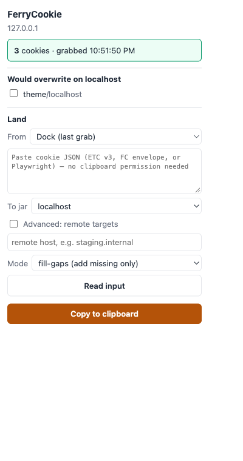

Click **Copy to clipboard** (or use the right-click menu "Copy cookies as localhost JSON", or `Ctrl/Cmd+Shift+9`). The credential state becomes visible — the clipboard now holds live session data, with a one-tap clear:

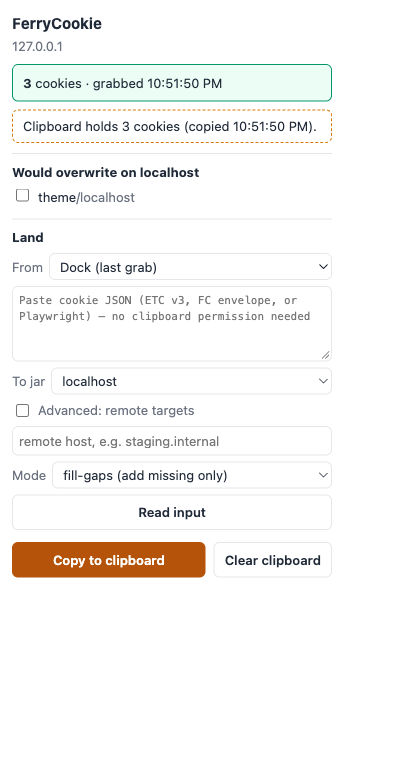

The clipboard carries EditThisCookie-v3 JSON with every host already rewritten to `localhost` (paste it into EditThisCookie anywhere — it imports as-is). The same grab also lands in the **dock**, the extension's session-scoped holding area, so the same-browser loop needs no clipboard at all.

## 3 · Land — the guarded write

Open your local dev server (`http://localhost:3000` — ports share one jar) and open the popup again. The **Land** section defaults to the common case: dock lane, `localhost` route, fill-gaps mode:

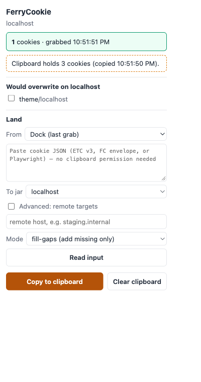

**Read input** shows the diff screen before anything is written — what lands, what overwrites, what's excluded, and how old the grab is:

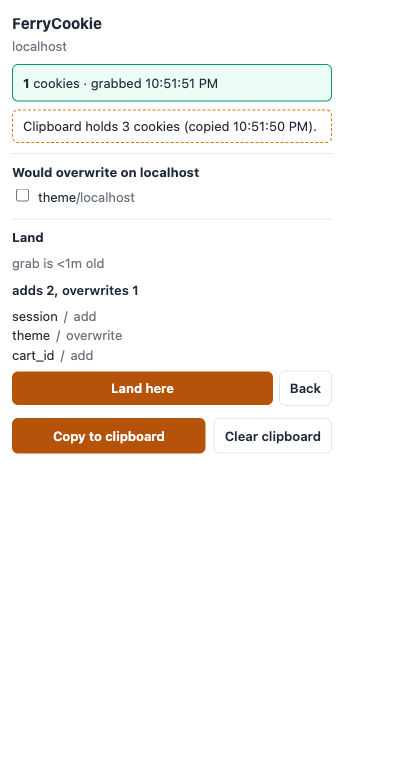

One click lands it (fill-gaps and merge are single-click *because they cannot destroy*; replace requires typing `LAND` — see §6). The report is asserted against the jar re-read, not the write calls — partial success is loudly partial:

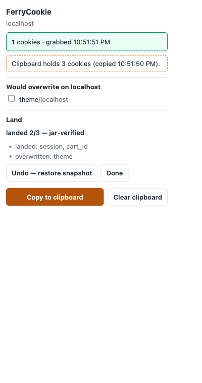

## 4 · Proof — the local app sees the session

Before the landing, `document.cookie` on the local dev server is empty:

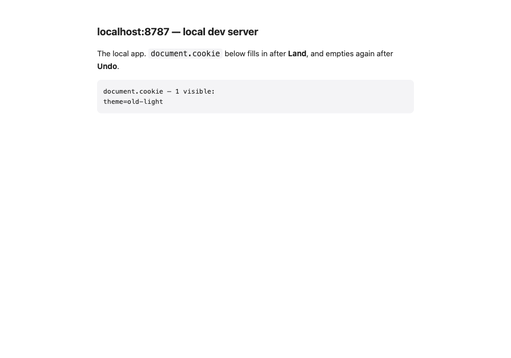

After, the ferried session is live:

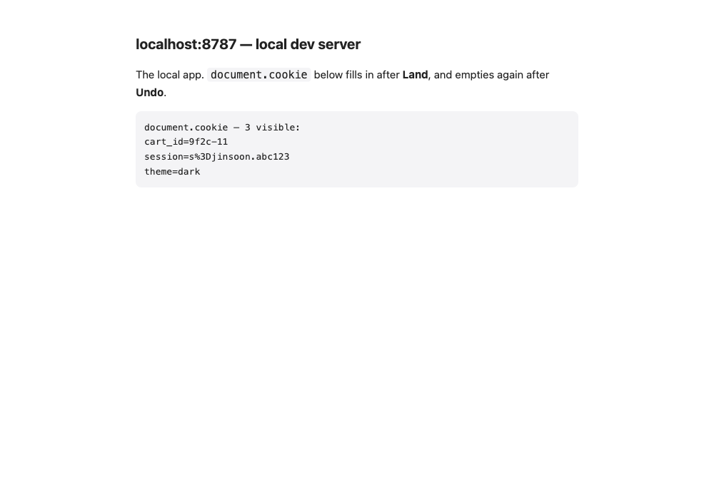

> The session cookie lands **readable by page JavaScript** even when production's was `httpOnly` — a documented deviation by design (ferry lanes never carry the flag). If localhost misbehaves, remember the local stage is wider than production's.

## 5 · Undo — one click, guarded

Every landing snapshots the target jar first (`storage.session`, at most 3, dies with the browser — that's the retention policy). The popup's snapshot list offers the restore, and the restore is itself diff-then-confirm, so the undo can never become the new accident:

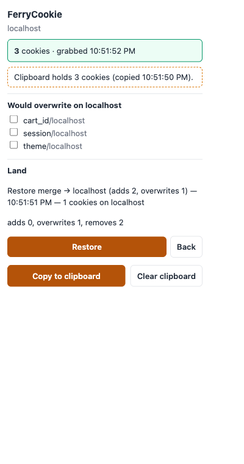

## 6 · Replace mode — the typed gate

Replace clears the jar before writing, so its confirm is proportional to its blast radius: type `LAND` to arm the button. The diff screen shows exactly what will be removed ("removes N") before you do:

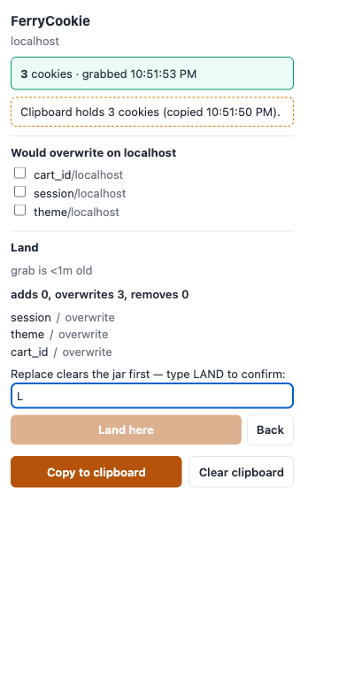

## 7 · Refusals — foreign input and empty jars

Paste a real-world export (or a seeded clipboard) whose rows claim other domains, and Land refuses by name — the tool only ever writes the confirmed local target, so cross-domain rows can only ever be *reported*:

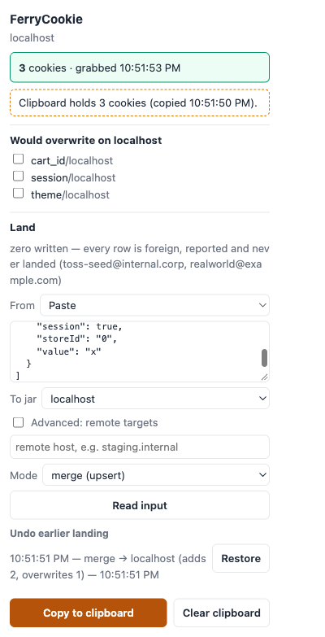

Pages with nothing to ferry disable the action with the reason instead of a dead button — an empty array never reaches the clipboard:

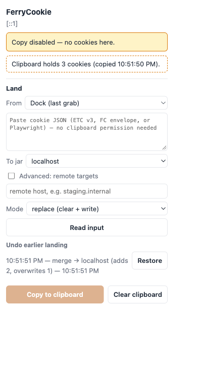

## Cheat sheet

| Gesture | Where | Posture |
|---|---|---|
| Copy | popup / context menu / `Ctrl+Cmd+9` | one click + visible credential state |
| Land (fill-gaps, merge, curated) | popup → Read input → Land | one click on the diff |
| Land (replace) | popup → mode: replace | type `LAND` |
| Undo | report screen or snapshot list | diff-then-confirm |
